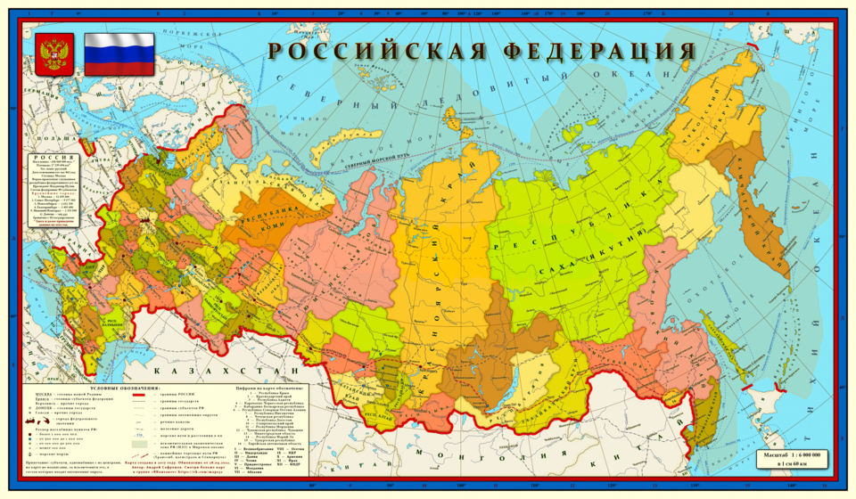

# Заголовок

## Вторая вложенность

### Третья вложенность

## Вид текста

*курсив 1*

_курсив 2_

**жирный 1**

__жирный 2__

***жирный с курсивом 1***

___жирный с курсивом 2___

## Списки

- Элемент 1
    - Вложенный элемент 1
    - Вложенный элемент 2
- Элемент 2
    - Вложенный элемент 1

### Нумерованный список

1. Первый элемент
2. Второй элемент
3. Третий элемент

1. 1
1. 2

## Ссылки

Ссылка на [OpenStreetMap](https://www.openstreetmap.org/#map=9/59.941/30.092), очень полезный ресурс?



## Цитирование

> Циата 1
>> Комментарий к цитате


```bash
git status
git add
```

---

### Solar System Exploration, 1950s – 1960s

- [x] Mercury
- [x] Venus
- [x] Earth (Orbit/Moon)
- [x] Mars
- [ ] Jupiter
- [ ] Saturn
- [ ] Uranus
- [ ] Neptune
- [ ] Comet Haley
